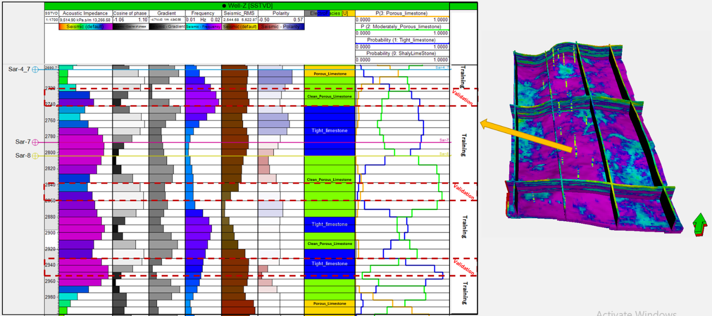
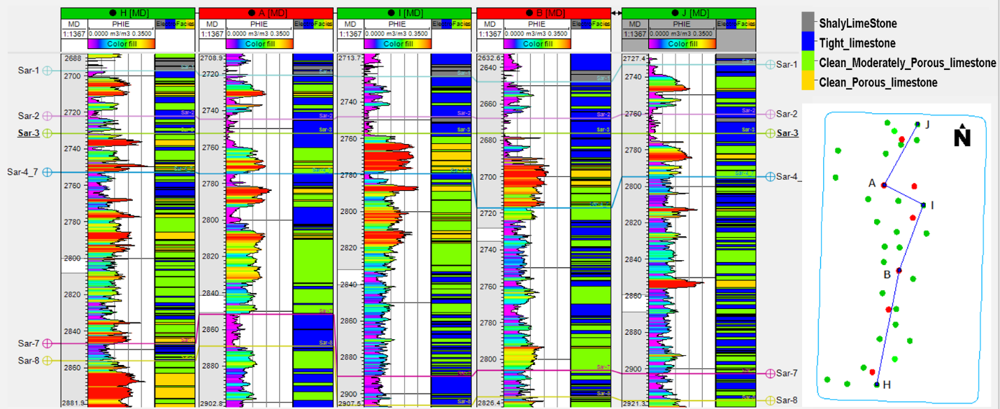
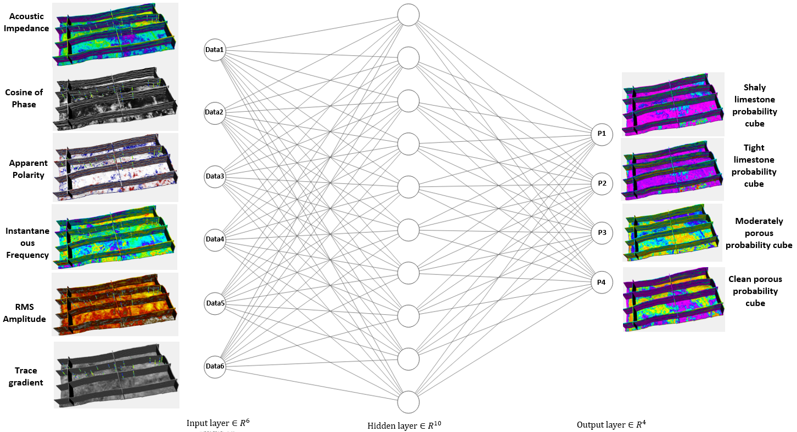
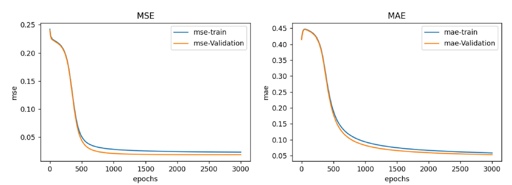
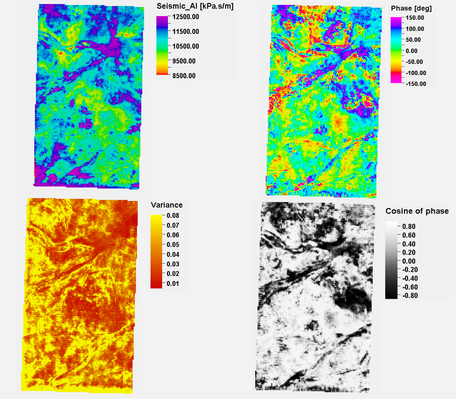
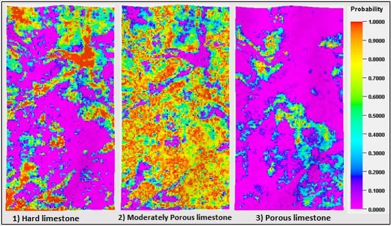

# Multi-Layer Perception for Seismic Facies Probability Cubes Extraction

!!! Petrel has been used for preparing the seismic attributes and the illustration of results !!!

Part of my paper: Rezaei, M., Emami Niri, M., Asghari, O., Talesh Hosseini, S., Emery, X., 2023. Seismic Data Integration Workflow in Pluri-Gaussian Simulation: Application to a Heterogeneous Carbonate Reservoir in Southwestern Iran. Nat. Resour. Res. 32, 1147–1175.
https://doi.org/10.1007/s11053-023-10198-0

In this project, a neural network including an input, a hidden and an output layer was applied on a set of seismic attributes to produce the probability cubes of facies. The neural network tried to establish a relationship between these attributes and different classes of facies represented by the well logs.



Results of facies probability calculation by neural network at one of the wells locations. The represented well section is associated with the indicated well within the acoustic impedance cube. From right to left on the well section: the first six columns show seismic attributes, the seventh column displays up-scaled facies logs, and the last column indicates the calculated probability for each facies.

## Training


```python
import numpy as np
import pandas as pd
```

### Loading Training Data

Here, I used my seismic attributes at well locations!

You can easiliy replace your excel file name and use the network for training your data!

The first 6 columns in my excel file (column 0 to 5) represent seismic attributes (inputs of the network) and the last column (column 6) contains the labels (outputs).


```python
file = pd.read_excel('F:/KrigNN/SeismicInWells_AllSar10.xlsx')
data = file.to_numpy()
inputs = data[:, :6] 
outputs = data[:, 6]
```


Effective porosity and electro-facies well logs of five wells in part of the Sarvak Formation.

### Shufflling


```python
per_list = np.random.permutation(len(data))
inputs_sh = []
outputs_sh = []
for i in range(len(data)):
    per_indx = per_list[i]
    tmp_input = inputs[per_indx]
    tmp_output = outputs[per_indx]
    inputs_sh.append(tmp_input)
    outputs_sh.append(tmp_output)

inputs_sh = np.array(inputs_sh)
outputs_sh = np.array(outputs_sh)

```

### Normalizing


```python
min_vec = inputs_sh.min(axis=0)
max_vec = inputs_sh.max(axis=0)
inputs_sh = (inputs_sh - min_vec)/(max_vec - min_vec)
```

### Train Test Splitting
I used 80% of data for training the network!

You can change it as you like!


```python
trn_test_split = int(0.8*len(inputs_sh))
X_train = inputs_sh[0:trn_test_split, :]
Y_train = outputs_sh[0:trn_test_split]

X_val = inputs_sh[trn_test_split :, :]
Y_val = outputs_sh[trn_test_split :]
```

### NN Structure


Structure of the neural network implemented in this study.


```python
from sklearn.neural_network import MLPClassifier
from sklearn import svm

mlp = MLPClassifier(hidden_layer_sizes=(100, 20), activation='relue',
                    solver='adam', batch_size=80, learning_rate='adaptive',
                    learning_rate_init=0.001, max_iter=200000, shuffle=False,
                    tol=0.00001, verbose=True, momentum=0.97)
mlp.fit(X_train, Y_train)

print('train accuracy : ', mlp.score(X_train, Y_train))
print('val accuracy : ', mlp.score(X_val, Y_val))
```


Curves of the neural network process: MSE (left) and MAE (right).

## Prediction

After training the network at the well locations, a relationship between the input data and various facies classes was established. The entire simulation network was subjected to this neurological relationship, and a probabilistic cube was produced for each electro-facies class, which was used as a trend in Pluri-Gaussian Simulation. 

### Transporting Data from Petrel into Python

1) Export your seismic attributes frm Petrel in GSLIB format



Sections of three seismic attributes to indicate their sensitivity to channels. 

2) Run following lines


```python
def read_gslib(filename:str):
    with open(filename, "r") as f:
        lines = f.readlines()
        ncols = int(lines[1].split()[0])
        col_names = [lines[i+2].strip() for i in range(ncols)]
        df = pd.read_csv(filename, skiprows=ncols+2, delim_whitespace= True, names= col_names)
        return df

df = read_gslib(filename="AI_RMS_Cos_Phase_Freq")
df.head()
data_forpred = df.to_numpy()
location = data_forpred[:, :6]
```

### Normalising


```python
min_forpred = data_forpred.min(axis=0)
max_forpred = inputs_forpred_p1.max(axis=0)
inputs_forpred = (inputs_forpred - min_forpred)/(max_forpred - min_forpred)
```

### Run the prediction


```python
pridprob = mlp.predict_proba(inputs_forpred) # Facies Probability
Prid = mlp.predict(inputs_forpred) # Facies
```

### Exporting Results in GSLIB for loading in Petrel


```python
lf = pd.DataFrame(locationinputs, columns=['i','j','k','x','y','z'])
pf = pd.DataFrame(pridprob, columns=['C1','C2','C3'])
Cf = pd.DataFrame(Prid, columns=['facies'])
of = lf.join(pf)
of = of.join(Cf)
def write_gslib(of:pd.DataFrame, filename:str):
    with open(filename, "w") as f:
        f.write("GSLIB Example Data\n")
        f.write(f"{len(of.columns)}\n")
        f.write("\n".join(of.columns)+"\n")
        for row in of.itertuples():
            row_data = "\t".join([f"{i:.3f}" for i in row[1:]])
            f.write(f"{row_data}\n")

 write_gslib(of, "Outputp1.txt")

```



A depth section from final probability cube of three different facies resulting from neural network process. The depth section located in zone Sarvak 4–7 is such that the probability of shale and shaly-limestone facies is zero.
